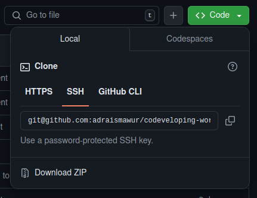

# Codeveloping workshop

This is the repository for the codeveloping workshop example.

In this workshop, you will go through a couple of excercises that involve common ways of working together on a software project.

This workshop also shows you how to contribute to someone else's repository on GitHub using your own fork and pull requests.

Please read through this readme in its entirety to get started.

## Getting started

All of these exercises assume the following:
- You have paired up with another person.
- You have GIT installed
- You are familiar with GIT in terms of committing, pushing and pulling
- You are familiar with the command line
- You have python installed

### Forking this repository
❗Only one of the people in your team needs to fork this repository.

In order to do this, follow these steps:

1. Click the fork button at the top-right of this website, between the "watch" and "star" buttons.
2. Click "Create Fork"

Once completed, you will be taken to your fork of the workshop repository.

This largely looks the exact same as the original repository, with the exception that you now have a panel above the files in the repository where you can "contribute" and "sync fork".
We will get back to those buttons later.

### Giving your team member(s) access

❗The person who forked the repository should do this.

1. Click on the "Settings" tab at the top of the page, next to the cog icon.
2. Go to "Collaborators"
3. Under Manage access, click "Add People"
4. Find your team member and click "Add [name] to this repository"

Once your team member accepts the invite, they will be allowed to push to your repository.

### Enabling issues on your fork

By default issues are not enabled on forks.
This may be because issues are generally made on the original repository.

For the purposes of this exercise, you need to enable the issues tab by doing the following:

1. Click on the "Settings" tab at the top of the page, next to the cog icon
2. Go to "General"
3. Under "Features", make sure "Issues" is ticked

You should see an "Issues" tab between the "Code" and "Pull requests" tabs at the top of the page

### Getting the code to your machine

In order to get the code on your machine, you must clone this fork of the workshop repository.

❗Every member of the team should clone the fork.

For this you will need the repository URL.
This URL can be found on the main page of your fork, under the green "Code" button:

Copy the URL found under the SSH tab.
The URL should start with `git@github.com`

Then, in a command line, navigate to where you want to copy the repository to, and run `git clone [url]`

Once you have a copy of the code on your machine, take a look at the `introduction.md` file under the `pages` folder.

Hi!
